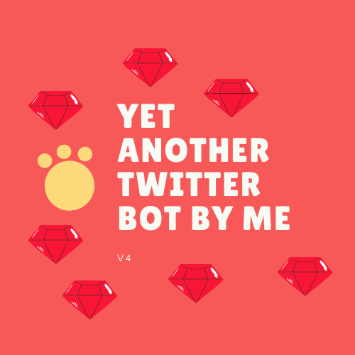

<h1 align="center">Welcome to yet-another-twitter-bot-by-me-v4 👋</h1>
<p>
  
  <a href="https://twitter.com/kammzinho" target="_blank">
    
  </a>
</p>



> A twitter bot project while studying Ruby & Clockwork & Procodile

### 🏠 [Homepage](https://github.com/C41949)
> Currently running this project on a raspberry pi 4.

### Older versions
#### First version
Raw Java 8 & Maven using hacky Threads. I don't have the code anymore :()

#### Second version
[Using Springboot and Scheduled services](https://github.com/kammradt/twitter-bots)

#### Third version
[Using Airflow](https://github.com/C41949/guidom). You can view more [details here](https://kammradt.super.site/)

## Install

```sh
bundler install
```

## Usage

```sh
procodile start --dev
# or
procodile start 
```

## Author

👤 **Vinícius Kammradt**

* Website: https://kammradt.super.site
* Twitter: [@kammzinho](https://twitter.com/kammzinho)
* Github: [@kammradt](https://github.com/kammradt)
* LinkedIn: [@vinicius-kammradt](https://linkedin.com/in/vinicius-kammradt)

## Show your support

Give a ⭐️ if this project helped you!
